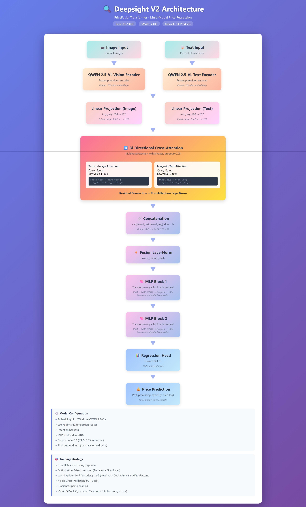

# Deepsight

## Amazon ML Challenge 2025 – Solution

### System architechture:

### Key Highlights

* **Multi-modal Transfer Learning**
  Utilized transfer learning to generate 768-dimensional embeddings from paired `text` and `image` inputs. Trained a price regression model on a dataset of **75,000** product entries, each containing an image, text description, and price.

* **V1 Architecture: CLIP + Bi-Directional Cross-Attention**

  * Employed CLIP with all layers frozen except the final layers of the image and text encoders.
  * Text and image embeddings were passed through a **bi-directional cross-attention** mechanism:

    * Text tokens attend to image tokens and vice versa.
    * Attention scores are added to the original embeddings.
  * Outputs are **layer-normalized**, concatenated, and normalized again.
  * Final regression head is a wide and deep net with deep: **Transformer MLP with skip connections** and wide: **Wide mlp**.
  * Used a combined loss: `(1-α) * huberloss + α * differentialble SMAPE loss`
  * Learning rates:

    * `1e-7` for frozen CLIP encoder fine-tuning.
    * `1e-5` for the custom regression head.
  * Prices are standardized before training, and predictions are **de-normalized** post-inference.

* **V2 Architecture: SigLIP + EmbeddingGemma + Advanced Training Strategies**

  * Switched to **SigLIP (200M)** and **EmbeddingGemma (300M)** for pretrained embeddings.
  * Maintained the bi-directional cross-attention mechanism with a series of `deep transformer mlp`.
  * Enhanced training with:
    * **Gradient clipping** and **Mixed precision** training with `Autocast` and `GradScaler`. 
    * **K-Fold Cross-Validation** with 90-10 train val splits.
    * **CosineAnnealingWarmRestarts** learning rate scheduler
    * **Huber loss** optimized on `log1p` of prices with predictions post-processed via `expm1p`.
  * Optimization focused on minimizing **SMAPE (Symmetric Mean Absolute Percentage Error)** for better real-world performance.

* Final submission: Used the second method on QWEN 2.5 VL embeddings for final submission.

* Achievements: Achieved **88th rank** among 22000 teams with an SMAPE score of `43.08` on test set.

* Notebooks:
* `example.ipynb`: With approach 1 results.
* `gemma.ipynb`: With approach 2 results.
* `utils.py`: some utils for download and setup.
* All experiments done on Lightning Studio: L4 GPU environment.
